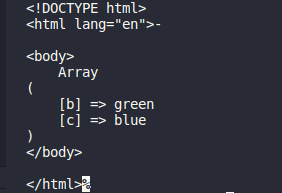

# Các hàm xử lí mảng

1.  Mảng cần xử lí

        $animals = array("cat", "dog", "fish");

1.  `count()` đếm số phần tử của mảng

    - Cú pháp:

            echo count($animals);

    - Kết quả:

      - 

1.  `foreach()` vòng lặp qua từng phần tử của mảng

    - Cú pháp:

            foreach ($animals as $x) {
            echo "$x "; }

    - Kết quả:

      - 

1.  `array_push()` thêm phần tử vào cuối mảng

    - Cú pháp:

      - Dùng hàm `print_r` để in ra kết quả

              array_push($animals, "bird");
              print_r($animals);

    - Kết quả:

      - 

1.  `unset()` xóa phần tử trong mảng

    - Cú pháp:

      - Dùng hàm `print_r` để in ra kết quả

              unset($animals[0], $animals[2]);
              print_r($animals);

    - Kết quả:

      - 

1.  Hàm sắp xếp mảng

    - Mảng cần sắp xếp:

            $number = array(5, 6, 3, 1, 2);

      1.  `sort()` sắp xếp mảng theo thứ tự tăng dần

          - Cú pháp:

            - Dùng hàm `print_r` để in ra kết quả

                    sort($number);
                    print_r($number);

          - Kết quả:

            

      1.  `rsort()` sắp xếp mảng theo thứ tự gairm dần

          - Cú pháp:

            - Dùng hàm `print_r` để in ra kết quả

                    rsort($number);
                    print_r($number);

          - Kết quả:

            

1.  Hàm sắp xếp mảng kết hợp

    1.  Mảng cần xử lí:

            $score = array("A" => "5", "C" => "7", "B" => "6");

    1.  `asort()` sắp xếp tăng dần mảng kết hợp theo giá trị

        - Cú pháp:

          - Dùng hàm `print_r` để in ra kết quả

                  asort($score);
                  print_r($score);

        - Kết quả:
          

    1.  `ksort` sắp xếp tăng dần mảng kết hợp theo khóa

        - Cú pháp:

          - Dùng hàm `print_r` để in ra kết quả

                  ksort($score);
                  print_r($score);

        - Kết quả:

          

    1.  `arsort()` sắp xếp giảm dần mảng kết hợp theo giá trị

        -Cú pháp:

            - Dùng hàm `print_r` để in ra kết quả

                    arsort($score);
                    print_r($score);

        - Kết quả:

          - 

    1.  `krsort()` sắp xếp giảm dần mnagr kết hợp theo khóa

        - Cú pháp:

          - Dùng hàm `print_r` để in ra kết quả

                  krsort($score);
                  print_r($score);

        - Kết quả:

          - 

1.  `array_change_key_case()` thay đổi tất cả các khóa trong một mảng thành chữ thường hoặc chữ hoa

    - Cú pháp:

            $score = array("a" => "5", "C" => "7", "b" => "6");
            print_r(array_change_key_case($score,CASE_UPPER));

    - Kết quả:

      - Chữ hoa:

        

      - Chữ thường:

        

1.  `array_chunk()` chia một mảng thành các phần của mảng mới

    - Cú pháp:

            $animals = array("Cat", "dog", "fish");
            print_r(array_chunk($score,2));

    - Kết quả:

      - 

1.  `array_column()` trả về các giá trị từ một cột trong mảng đầu vào

    - Cú pháp:

            $a = array(
            array(
                'id' => 01,
                'name' => 'Nguyen',
                'score' => '10',
            ),
            array(
                'id' => 02,
                'name' => 'Nam',
                'score' => '9',
            ),
            array(
                'id' => 03,
                'name' => 'Hoang',
                'score' => '10',
            )
            );

            $last_names = array_column($a, 'name');
            print_r($last_names);

    - Kết quả:

      

1.  `array_combine()` tạo một mảng bằng cách sử dụng các phần tử từ một mảng khóa và một mảng giá trị

    - Cú pháp:

            $name = array("Nguyen", "Nam", "Hoang");
            $score = array("10", "9", "10");
            $c = array_combine($name, $score);
            print_r($c);

    - Kết quả:

      

1.  `array_count_values()` đếm tất cả các giá trị của một mảng

    - Cú pháp:

            $a = array("A", "Cat", "Dog", "A", "Dog");
            print_r(array_count_values($a));

    - Kết quả:

      

1.  `array_diff()` so sánh các giá trị của hai (hoặc nhiều) mảng và trả về sự khác biệt. Hàm này so sánh các giá trị của hai (hoặc nhiều) mảng và trả về một mảng chứa các mục từ mảng1 không có trong mảng2 hoặc mảng3, v.v.

    - Cú pháp:

            $a1 = array("a" => "red", "b" => "green", "c" => "blue", "d" => "yellow");
            $a2 = array("e" => "red", "f" => "black", "g" => "purple");
            $a3 = array("a" => "red", "b" => "black", "h" => "yellow");
            $result = array_diff($a1, $a2, $a3);
            print_r($result);

    - Kết quả:

      

1.  `array_diff_assoc()` so sánh các khóa và giá trị của hai (hoặc nhiều) mảng và trả về sự khác biệt. Hàm này so sánh các giá trị của hai (hoặc nhiều) mảng và trả về một mảng chứa các mục từ mảng1 không có trong mảng2 hoặc mảng3, v.v.

    - Cú pháp:

            $a1 = array("a" => "red", "b" => "green", "c" => "blue", "d" => "yellow");
            $a2 = array("a" => "red", "b" => "green", "c" => "blue");
            $result = array_diff_assoc($a1, $a2);
            print_r($result);

    - Kết quả:

      

1.  `array_diff_key()` so sánh các khóa của hai (hoặc nhiều) mảng và trả về sự khác biệt

    - Cú pháp:

          $a1 = array("a" => "red", "b" => "green", "c" => "blue");
          $a2 = array("a" => "red", "c" => "blue", "d" => "pink");
          $result = array_diff_key($a1, $a2);
          print_r($result);

    - Kết quả:

      

1.  `array_diff_uassoc()` so sánh các khóa và giá trị của hai (hoặc nhiều) mảng và trả về sự khác biệt

    - Cú pháp:

          $a1 = array("a" => "red", "b" => "green", "c" => "blue");
          $a2 = array("a" => "red", "c" => "blue", "d" => "pink");
          $result = array_diff_key($a1, $a2);
          print_r($result);

    - Kết quả:

      - 

1.  `array_diff_ukey()` so sánh các khóa của hai (hoặc nhiều) mảng và trả về sự khác biệt

    - Cú pháp:

          function myfunction($a, $b)
               {
                       if ($a === $b) {
                       return 0;
                       }
                       return ($a > $b) ? 1 : -1;
               }
               $a1 = array("a" => "red", "b" => "green", "c" => "blue");
               $a2 = array("a" => "black", "b" => "yellow", "d" => "brown");
               $a3 = array("e" => "purple", "f" => "white", "a" => "gold");
               $result = array_diff_ukey($a1, $a2, $a3, "myfunction");
               print_r($result);

    - Kết quả:

      - 

1.  `array_fill()` điền vào một mảng với các giá trị

    - Cú pháp: 

          $a1 = array_fill(3, 4, "blue");
          print_r($a1);

    - Kết quả:

        - 

1.  `array_fill_keys()` điền vào một mảng các giá trị, chỉ định các khóa

    - Cú pháp :

          $keys = array("a", "b", "c", "d");
          $a1 = array_fill_keys($keys, "blue");
          print_r($a1);

    - Kết quả: 

        - 
        
1.  `array_filter()` lọc các giá trị của một mảng bằng hàm gọi lại

    - Cú pháp:

          function test_odd($var)
          {
          return ($var & 1);
          }
          $a1 = array(1, 3, 2, 3, 4);
          print_r(array_filter($a1, "test_odd"));

    - Kết quả: 

        - 

1.  `array_flip()` đổi tất cả các khóa với các giá trị liên quan của chúng trong một mảng

    - Cú pháp: 

          $a1 = array("a" => "red", "b" => "green", "c" => "blue", "d" => "yellow");
          $result = array_flip($a1);
          print_r($result);

    _Kết quả: 

        - 

1.  `array_intersect()` so sánh các giá trị của hai (hoặc nhiều) mảng và trả về kết quả khớp

    - Cú pháp:

          $a1 = array("a" => "red", "b" => "green", "c" => "blue", "d" => "yellow");
          $a2 = array("e" => "red", "f" => "green", "g" => "blue");
          $result = array_intersect($a1, $a2);
          print_r($result);

    - Kết quả: 

        - 

1.  `array_intersect_assoc()` so sánh các khóa và giá trị của hai (hoặc nhiều) mảng và trả về kết quả khớp

    - Cú pháp:

          $a1 = array("a" => "red", "b" => "green", "c" => "blue", "d" => "yellow");
          $a2 = array("a" => "red", "b" => "green", "g" => "blue");
          $a3 = array("a" => "red", "b" => "green", "g" => "blue");
    
          $result = array_intersect_assoc($a1, $a2, $a3);
          print_r($result);

    - Kết quả: 

        - 

1.  `array_intersect_key()` so sánh các khóa của hai (hoặc nhiều) mảng và trả về kết quả khớp

    - Cú pháp:

          $a1 = array("a" => "red", "b" => "green", "c" => "blue");
          $a2 = array("c" => "yellow", "d" => "black", "e" => "brown");
          $a3 = array("f" => "green", "c" => "purple", "g" => "red");
      
          $result = array_intersect_key($a1, $a2, $a3);
          print_r($result);
      
    - Kết quả: 

        - 

1.  `array_intersect_uassoc()` hàm so sánh các khóa và giá trị của hai (hoặc nhiều) mảng và trả về kết quả khớp

    - Cú pháp: 

          function myfunction($a, $b)
          {
              if ($a === $b) {
                  return 0;
              }
              return ($a > $b) ? 1 : -1;
          }
    
          $a1 = array("a" => "red", "b" => "green", "c" => "blue");
          $a2 = array("d" => "red", "b" => "green", "e" => "blue");
          
          $result = array_intersect_uassoc($a1, $a2, "myfunction");
          print_r($result);

      - Kết quả: 

          - 

1.  `array_intersect_ukey()` hàm so sánh các khóa của hai (hoặc nhiều) mảng và trả về kết quả khớp

      - Cú pháp: 

            function myfunction($a, $b)
            {
                if ($a === $b) {
                    return 0;
                }
                return ($a > $b) ? 1 : -1;
            }
            
            $a1 = array("a" => "red", "b" => "green", "c" => "blue");
            $a2 = array("a" => "black", "b" => "yellow", "d" => "brown");
            $a3 = array("e" => "purple", "f" => "white", "a" => "gold");
            
            $result = array_intersect_ukey($a1, $a2, $a3, "myfunction");
            print_r($result);

      - Kết quả: 

          - 

1.  `array_key_exists()` kiểm tra một mảng để tìm khóa đã chỉ định và trả về true nếu khóa tồn tại và trả về false nếu khóa không tồn tại

      - Cú pháp: 

            $a = array("Volvo" => "XC90", "BMW" => "X5");
            if (array_key_exists("Toyota", $a)) {
                echo "Key exists!";
            } else {
                echo "Key does not exist!";
            }
      
      - Kết quả: 

          - 

1.  `array_keys()` trả về một mảng chứa các khóa

      - Cú pháp:

            $a=array("Volvo"=>"XC90","BMW"=>"X5","Toyota"=>"Highlander");
            print_r(array_keys($a));

      - Kết quả: 

          - 

1.  `array_map()` gửi từng giá trị của một mảng đến một hàm do người dùng tạo và trả về một mảng có các giá trị mới do hàm do người dùng tạo ra

      - Cú pháp:

            function myfunction($v)
            {
                return ($v * $v);
            }
            
            $a = array(1, 2, 3, 4, 5);
            print_r(array_map("myfunction", $a));

      - Kết quả: 

          - 

1.  `array_merge()` hợp nhất một hoặc nhiều mảng thành một mảng

      - Cú pháp: 

            $a1 = array("red", "green");
            $a2 = array("blue", "yellow");
            print_r(array_merge($a1, $a2));

      - Kết quả: 

          - 

1.  `array_merge_recursive()` hợp nhất một hoặc nhiều mảng thành một mảng.

      - Cú pháp: 

              $a1 = array("a" => "red", "b" => "green");
              $a2 = array("c" => "blue", "b" => "yellow");
              print_r(array_merge_recursive($a1, $a2));

      - Kết quả:

          - 

1.  `array_multisort()` trả về một mảng đã được sắp xếp. Bạn có thể chỉ định một hoặc nhiều mảng. Hàm sắp xếp mảng đầu tiên và các mảng khác theo sau, sau đó, nếu hai hoặc nhiều giá trị giống nhau, hàm sẽ sắp xếp mảng tiếp theo, v.v

      - Cú pháp: 

              $a = array("Dog", "Cat", "Horse", "Bear", "Zebra");
              array_multisort($a);
              print_r($a);

      - Kết quả: 

          - 

1.  `array_pad()` chèn một số phần tử được chỉ định, với một giá trị được chỉ định, vào một mảng

      - Cú pháp:

            $a = array("red", "green");
            print_r(array_pad($a, 5, "blue"));

      - Kết quả: 
       
          - 

1.  `array_pop()` xóa phần tử cuối cùng của mảng

      - Cú pháp: 

            $a = array("red", "green", "blue");
            array_pop($a);
            print_r($a);

      - Kết quả: 

          - 
    
1.  `array_product()` tính toán và trả về tích của một mảng

      - Cú pháp: 

            $a = array(5, 5);
            echo (array_product($a));

      - Kết quả :

      - 

1.  `array_push()` chèn một hoặc nhiều phần tử vào cuối mảng

      - Cú pháp:

            $a = array("red", "green");
            array_push($a, "blue", "yellow");
            print_r($a);

      - Kết quả:

          - 

1.  `array_rand()` trả về một khóa ngẫu nhiên từ một mảng hoặc trả về một mảng các khóa ngẫu nhiên nếu bạn chỉ định rằng hàm sẽ trả về nhiều hơn một khóa

      - Cú pháp: 

            $a = array("red", "green", "blue", "yellow", "brown");
            $random_keys = array_rand($a, 3);
            echo $a[$random_keys[0]] . " ";
            echo $a[$random_keys[1]] . " ";
            echo $a[$random_keys[2]];

      - Kết quả: 

          - 

1.  `array_reduce()` gửi các giá trị trong một mảng tới hàm do người dùng xác định và trả về một chuỗi

      - Cú pháp:

            function myfunction($v1, $v2)
            {
                return $v1 . "-" . $v2;
            }
            $a = array("Dog", "Cat", "Horse");
            print_r(array_reduce($a, "myfunction", 5));

      - Kết quả:

          - 

1.  `array_replace()` thay thế các giá trị của mảng đầu tiên bằng các giá trị từ mảng sau

      - Cú pháp: 

            $a1 = array("red", "green");
            $a2 = array("blue", "yellow");
            print_r(array_replace($a1, $a2));

      - Kết quả:
       
          - 

1.  `array_replace_recursive()` thay thế đệ quy các giá trị của mảng đầu tiên bằng các giá trị từ các mảng sau

      - Cú pháp:

            $a1 = array("a" => array("red"), "b" => array("green", "blue"), );
            $a2 = array("a" => array("yellow"), "b" => array("black"));
            print_r(array_replace_recursive($a1, $a2));

      - Kết quả; 

          - 

1.  `array_reverse()` trả về một mảng theo thứ tự ngược lại

      - Cú pháp:

            $a=array("a"=>"Volvo","b"=>"BMW","c"=>"Toyota");
            print_r(array_reverse($a));

      - Kết quả:

          - 

1.  `array_search()` tìm kiếm một mảng cho một giá trị và trả về khóa

      - Cú pháp: 

            $a=array("a"=>"red","b"=>"green","c"=>"blue");
            echo array_search("red",$a);

      - Kết quả:

          - 

1.  `array_shift()` xóa phần tử đầu tiên khỏi mảng và trả về giá trị của phần tử bị xóa

      - Cú pháp:

            $a=array("a"=>"red","b"=>"green","c"=>"blue");
            echo array_shift($a);
            print_r ($a);

      - Kết quả: 

          - 

1.  `array_slice()` trả về các phần đã chọn của một mảng

      - Cú pháp:

            $$a=array("red","green","blue","yellow","brown");
            print_r(array_slice($a,2));

      - Kết quả: 

          - 

1.  `array_splice()` xóa các phần tử đã chọn khỏi mảng và thay thế nó bằng các phần tử mới. Hàm cũng trả về một mảng có các phần tử đã bị loại bỏ

      - Cú pháp:

            $a1=array("a"=>"red","b"=>"green","c"=>"blue","d"=>"yellow");
            $a2=array("a"=>"purple","b"=>"orange");
            array_splice($a1,0,2,$a2);
            print_r($a1);

      - Kết quả: 

          - 

1.  `array_sum()` trả về tổng của tất cả các giá trị trong mảng

      - Cú pháp:

            $a=array(5,15,25);
            echo array_sum($a);

      - Kết quả: 

          - 

1.  `array_udiff()` so sánh các giá trị của hai hoặc nhiều mảng và trả về sự khác biệt

      - Cú pháp:

            function myfunction($a,$b)
            {
            if ($a===$b)
              {
              return 0;
              }
              return ($a>$b)?1:-1;
            }

            $a1=array("a"=>"red","b"=>"green","c"=>"blue");
            $a2=array("a"=>"blue","b"=>"black","e"=>"blue");

            $result=array_udiff($a1,$a2,"myfunction");
            print_r($result);

      - Kết quả: 

          - 

1.  `array_udiff_assoc()` so sánh các khóa và giá trị của hai hoặc nhiều mảng và trả về sự khác biệt

      - Cú pháp:

            function myfunction($a,$b)
            {
            if ($a===$b)
              {
              return 0;
              }
              return ($a>$b)?1:-1;
            }

            $a1=array("a"=>"red","b"=>"green","c"=>"blue");
            $a2=array("a"=>"red","b"=>"blue","c"=>"green");

            $result=array_udiff_assoc($a1,$a2,"myfunction");
            print_r($result);

      - Kết quả: 

          - 

1.  `array_udiff_uassoc()` so sánh các khóa và giá trị của hai hoặc nhiều mảng và trả về sự khác biệt

      - Cú pháp:

            function myfunction_key($a,$b)
            {
            if ($a===$b)
              {
              return 0;
              }
              return ($a>$b)?1:-1;
            }

            function myfunction_value($a,$b)
            {
            if ($a===$b)
              {
              return 0;
              }
              return ($a>$b)?1:-1;
            }

            $a1=array("a"=>"red","b"=>"green","c"=>"blue");
            $a2=array("a"=>"red","b"=>"green","c"=>"green");

            $result=array_udiff_uassoc($a1,$a2,"myfunction_value","myfunction_key");
            print_r($result);

      - Kết quả: 

          - 

1.  `array_uintersect()` so sánh các giá trị của hai hoặc nhiều mảng và trả về kết quả khớp

      - Cú pháp:

            function myfunction($a,$b)
            {
            if ($a===$b)
              {
              return 0;
              }
              return ($a>$b)?1:-1;
            }

            $a1=array("a"=>"red","b"=>"green","c"=>"blue");
            $a2=array("a"=>"blue","b"=>"black","e"=>"blue");

            $result=array_uintersect($a1,$a2,"myfunction");
            print_r($result);

      - Kết quả: 

          - 

1.  `array_uintersect_assoc()` so sánh các khóa và giá trị của hai hoặc nhiều mảng và trả về kết quả khớp

      - Cú pháp:

            function myfunction($a,$b)
            {
            if ($a===$b)
              {
              return 0;
              }
              return ($a>$b)?1:-1;
            }

            $a1=array("a"=>"red","b"=>"green","c"=>"blue");
            $a2=array("a"=>"red","b"=>"blue","c"=>"green");

            $result=array_uintersect_assoc($a1,$a2,"myfunction");
            print_r($result);

      - Kết quả: 

          - 

1.  `array_uintersect_uassoc()` so sánh các khóa và giá trị của hai hoặc nhiều mảng và trả về kết quả khớp

      - Cú pháp:

            function myfunction_value($a,$b) {
                if ($a===$b) {
                  return 0;
                }
                return ($a>$b)?1:-1;
              }
              
              function myfunction_key($a,$b) {
                if ($a===$b) {
                  return 0;
                }
                return ($a>$b)?1:-1;
              }
              
              $a1=array("a"=>"red","b"=>"green","c"=>"blue");
              $a2=array("a"=>"red","b"=>"green","c"=>"green");
              
              $result=array_uintersect_uassoc($a1,$a2,"myfunction_value","myfunction_key");
              print_r($result);

      - Kết quả: 

          - 

1.  `array_unique()` loại bỏ các giá trị trùng lặp khỏi một mảng. Nếu hai hoặc nhiều giá trị mảng giống nhau, giao diện đầu tiên sẽ được giữ nguyên và giao diện còn lại sẽ bị xóa

      - Cú pháp:

            $a=array("a"=>"red","b"=>"green","c"=>"red");
            print_r(array_unique($a));

      - Kết quả: 

          - 

1.  `array_unshift()` chèn các phần tử mới vào một mảng. Các giá trị mảng mới sẽ được chèn vào đầu mảng

      - Cú pháp:

            $a=array("a"=>"red","b"=>"green");
            array_unshift($a,"blue");
            print_r($a);

      - Kết quả: 

          - 

1.  `array_values()` trả về một mảng chứa tất cả các giá trị của một mảng

      - Cú pháp:

            $a=array("Name"=>"Peter","Age"=>"41","Country"=>"USA");
            print_r(array_values($a));

      - Kết quả: 

          - 

1.  `array_walk()` chạy từng phần tử mảng trong một hàm do người dùng xác định. Các khóa và giá trị của mảng là các tham số trong hàm

      - Cú pháp:

            function myfunction($value,$key)
            {
            echo "The key $key has the value $value ";
            }
            $a=array("a"=>"red","b"=>"green","c"=>"blue");
            array_walk($a,"myfunction");

      - Kết quả: 

          - 

1.  `array_walk_recursive()` chạy từng phần tử mảng trong một hàm do người dùng xác định. Các khóa và giá trị của mảng là các tham số trong hàm. Sự khác biệt giữa hàm này và hàm array_walk() là ở chỗ với hàm này bạn có thể làm việc với các mảng sâu hơn (mảng bên trong một mảng)

      - Cú pháp:

            function myfunction($value,$key)
            {
            echo "The key $key has the value $value ";
            }
            $a1=array("a"=>"red","b"=>"green");
            $a2=array($a1,"1"=>"blue","2"=>"yellow");
            array_walk_recursive($a2,"myfunction");

      - Kết quả: 

          - 

1.  `compact()` tạo một mảng từ các biến và giá trị của chúng

      - Cú pháp:

            $firstname = "Peter";
            $lastname = "Griffin";
            $age = "41";

            $result = compact("firstname", "lastname", "age");

            print_r($result);

      - Kết quả: 

          - 

1.  `current()` hàm trả về giá trị của phần tử hiện tại trong mảng

      - Cú pháp:

            $people = array("Peter", "Joe", "Glenn", "Cleveland");

            echo current($people) . " ";

      - Kết quả: 

          - 

1.  `each()` trả về khóa và giá trị của phần tử hiện tại và di chuyển con trỏ bên trong về phía trước

1.  `end()` di chuyển con trỏ bên trong đến và xuất ra phần tử cuối cùng trong mảng

      - Cú pháp:

            $people = array("Peter", "Joe", "Glenn", "Cleveland");
            echo current($people) . " ";
            echo end($people);

      - Kết quả: 

          - 

1.  `extract()` nhập các biến vào bảng ký hiệu cục bộ từ một mảng

      - Cú pháp:

            $a = "Original";
            $my_array = array("a" => "Cat","b" => "Dog", "c" => "Horse");
            extract($my_array);
            echo "\$a = $a; \$b = $b; \$c = $c";

      - Kết quả: 

          - 

1.  `in_array()` tìm kiếm một mảng cho một giá trị cụ thể

      - Cú pháp:

            $people = array("Peter", "Joe", "Glenn", "Cleveland");

            if (in_array("Glenn", $people))
              {
              echo "Match found";
              }
            else
              {
              echo "Match not found";
              }

      - Kết quả: 

          - 

1.  `key()` trả về khóa phần tử từ vị trí con trỏ bên trong hiện tại

      - Cú pháp:

            $people=array("Peter","Joe","Glenn","Cleveland");
            echo "The key from the current position is: " . key($people);

      - Kết quả: 

          - 

1.  `list()` được sử dụng để gán giá trị cho danh sách các biến trong một thao tác

      - Cú pháp:

            $my_array = array("Dog","Cat","Horse");

            list($a, $b, $c) = $my_array;
            echo "I have several animals, a $a, a $b and a $c.";

      - Kết quả: 

          - 

1.  `natcasesort()` sắp xếp một mảng bằng cách sử dụng thuật toán "thứ tự tự nhiên". Các giá trị giữ nguyên khóa gốc của chúng.
    Trong thuật toán tự nhiên, số 2 nhỏ hơn số 10. Trong sắp xếp trên máy tính, 10 nhỏ hơn 2, vì số đầu tiên trong "10" nhỏ hơn 2

      - Cú pháp:

            $temp_files = array("temp15.txt","Temp10.txt",
            "temp1.txt","Temp22.txt","temp2.txt");

            natsort($temp_files);
            echo "Natural order: ";
            print_r($temp_files);
            echo " ";

            natcasesort($temp_files);
            echo "Natural order case insensitve: ";
            print_r($temp_files);

      - Kết quả: 

          - 

1.  `natsort()` sắp xếp một mảng bằng cách sử dụng thuật toán "thứ tự tự nhiên". Các giá trị giữ nguyên khóa gốc của chúng.
    Trong thuật toán tự nhiên, số 2 nhỏ hơn số 10. Trong sắp xếp trên máy tính, 10 nhỏ hơn 2, vì số đầu tiên trong "10" nhỏ hơn 2

      - Cú pháp:

            $temp_files = array("temp15.txt","temp10.txt",
            "temp1.txt","temp22.txt","temp2.txt");

            sort($temp_files);
            echo "Standard sorting: ";
            print_r($temp_files);
            echo " ";

            natsort($temp_files);
            echo "Natural order: ";
            print_r($temp_files);

      - Kết quả: 

          - 

1.  `next()` di chuyển con trỏ bên trong tới và xuất ra phần tử tiếp theo trong mảng

      - Cú pháp:

            $people = array("Peter", "Joe", "Glenn", "Cleveland");

            echo current($people) . " ";
            echo next($people);

      - Kết quả: 

          - 

1.  `pos()` trả về giá trị của phần tử hiện tại trong một mảng

      - Cú pháp:

            $people = array("Peter", "Joe", "Glenn", "Cleveland");

            echo pos($people) . " ";

      - Kết quả: 

          - 

1.  `prev()` di chuyển con trỏ bên trong tới và xuất ra phần tử trước đó trong mảng

      - Cú pháp:

            $people = array("Peter", "Joe", "Glenn", "Cleveland");

            echo current($people) . " ";
            echo next($people) . " ";
            echo prev($people);

      - Kết quả: 

          - 

1.  `range()` tạo một mảng chứa một loạt các phần tử

      - Cú pháp:

            $number = range(0,5);
            print_r ($number);

      - Kết quả: 

          - 

1.  `reset()` di chuyển con trỏ nội bộ tới phần tử đầu tiên của mảng

      - Cú pháp:

            $people = array("Peter", "Joe", "Glenn", "Cleveland");

            echo current($people) . " ";
            echo next($people) . " ";

            echo reset($people);

      - Kết quả: 

          - 

1.  `rsort()` sắp xếp một mảng được lập chỉ mục theo thứ tự giảm dần

      - Cú pháp:

            $cars=array("Volvo","BMW","Toyota");
            rsort($cars);

            $clength=count($cars);
            for($x=0;$x<$clength;$x++)
              {
              echo $cars[$x];
              echo " ";
              }

      - Kết quả: 

          - 

1.  `shuffle()` sắp xếp ngẫu nhiên thứ tự các phần tử trong mảng.Hàm này gán khóa mới cho các phần tử trong mảng

      - Cú pháp:

            $my_array = array("red","green","blue","yellow","purple");

            shuffle($my_array);
            print_r($my_array);

      - Kết quả: 

          - 

1.  `sort()` sắp xếp một mảng được lập chỉ mục theo thứ tự tăng dần

      - Cú pháp:

            $cars = array("Volvo", "BMW", "Toyota");
              sort($cars);

              foreach ($cars as $key => $val) {
                  echo "cars[" . $key . "] = " . $val . " ";
              }

      - Kết quả: 

          - 

1.  `uasort()` sắp xếp một mảng theo các giá trị bằng cách sử dụng hàm so sánh do người dùng xác định và duy trì liên kết chỉ mục

      - Cú pháp:

            function my_sort($a, $b) {
              if ($a == $b) return 0;
              return ($a < $b) ? -1 : 1;
            }
            
            $arr = array("a"=>4, "b"=>2, "c"=>8, "d"=>6);
            uasort($arr, "my_sort");
            
            foreach($arr as $key => $value) {
              echo "[" . $key . "] => " . $value;
              echo " ";
            }

      - Kết quả: 

          - 

1.  `uksort()` sắp xếp một mảng theo các khóa bằng hàm so sánh do người dùng xác định

      - Cú pháp:

            function my_sort($a, $b) {
              if ($a == $b) return 0;
              return ($a < $b) ? -1 : 1;
            }
            
            $arr = array("a"=>4, "b"=>2, "c"=>8, "d"=>6);
            uksort($arr, "my_sort");
            
            foreach($arr as $key => $value) {
              echo "[" . $key . "] => " . $value;
              echo " ";
            }

      - Kết quả: 

          - 

1.  `usort()` sắp xếp một mảng theo các giá trị bằng hàm so sánh do người dùng xác định

      - Cú pháp:

            function my_sort($a, $b) {
              if ($a == $b) return 0;
              return ($a < $b) ? -1 : 1;
            }
            
            $a = array(4, 2, 8, 6);
            usort($a, "my_sort");
            
            foreach($a as $key => $value) {
              echo "[" . $key . "] => " . $value;
              echo " ";
            }

      - Kết quả: 

          - 