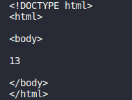
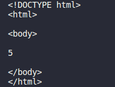

# Các hàm xử lí chuỗi
1.  Chuỗi cần sử lí:

        $string = " PHP Strings ";
1. `strlen()` trả về độ dài của chuỗi

   - Cú pháp: 

            echo strlen($string);

    - Kết quả:
        - 

1. `str_word_count` đếm số từ trong một chuỗi

    - Cú pháp:
            
            echo str_word_count($string);
    
    - Kết quả:
        - 

1. `strpos()` tìm kiếm một văn bản cụ thể trong một chuỗi

    - Cú pháp:

            echo strpos($string, "Nguyên");
    
    - Kết quả:
        - 

1. `strtoupper()` trả về chuỗi ở dạng chữ in hoa

    - Cú pháp:
            
            echo strtoupper($string);

    - Kết quả:
        - 

1. `strtolower()` trả về chuỗi ở dạng chữ thường

    - Cú pháp:

            cho strtolower($string);

    - Kết quả: 
        - 

1. `str_replace()` thay thế một số ký tự bằng một số ký tự khác trong chuỗi

    - Cú pháp:

            echo str_replace("Strings", "Arrays", $string);

    - Kết quả:
        - 

1. `strrev()` đảo ngược 1 chuỗi

    - Cú pháp: 

            echo strrev($string);
    
    - Kết quả:
        - 

1. `trim()` xóa khoảng trắng ở đầu hoặc cuối

    - Cú pháp:

            echo trim($string);

    - Kết quả:
        - 

1. `explode()` chia 1 chuỗi thành 1 mảng

    - Cú pháp:

        - Sử dụng hàm `print_r()` để in kết quả

                $y = explode(" ", $string);
                print_r($y);

    - Kết quả:
        - 

1. `substr()` trả về 1 phạm vi kí tự

     1. Chỉ định mục bắt đầu và số lượng ký tự muốn trả về

         - Cú pháp:

                echo substr($string, 1, 3);
        
        - Kết quả: 

          - 
        
     1. Cắt đến cuối
         
         - Cú pháp:

                echo substr($string, );

        - Kết quả: 

          - 

     1. Sử dụng chỉ mục âm để cắt từ cuối

         - Cú pháp:

                echo substr($string,-8, 7);

        - Kết quả: 

          - 

     1. Sử dụng độ dài âm để chỉ định số lượng ký tự cần bỏ qua, bắt đầu từ cuối chuỗi:
        
         - Cú pháp:

                echo substr($string, 5, -3);
        
        - Kết quả: 

          - 
